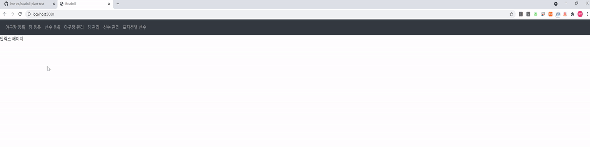
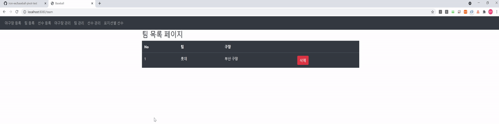
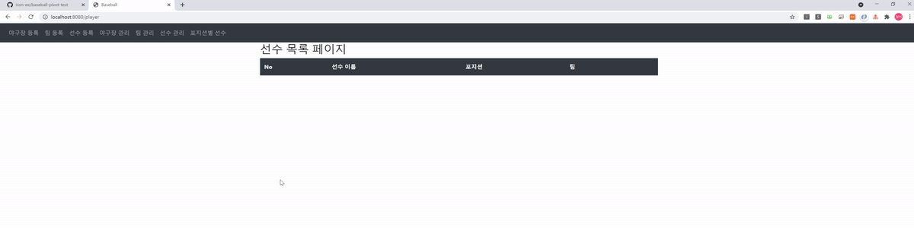
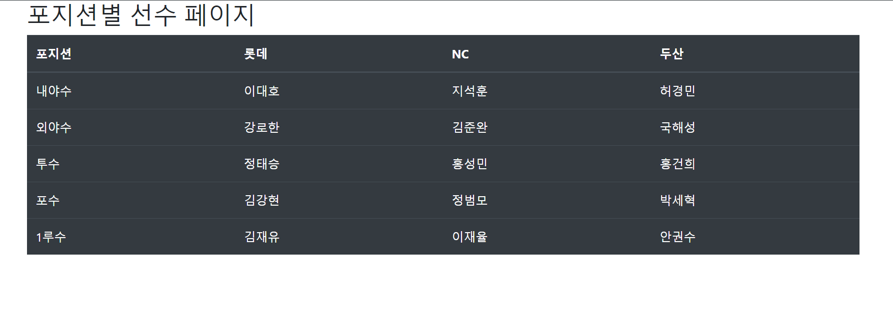

# 스프링부트 베이스볼 pivot 

</br>

## 의존성
- Spring Web
- Spring Boot DevTools
- Spring Data JPA
- Lombok
- MySQL Driver


</br>

## DB 설정

```sql
create user 'baseball'@'%' identified by 'base1234';
GRANT ALL PRIVILEGES ON *.* TO 'baseball'@'%';
create database baseball;
```


### 야구장 등록, 목록



</br>
</br>

### 팀 등록, 목록



</br>
</br>

### 선수 등록, 목록



</br>
</br>

### 포지션별 선수 (pivot)

